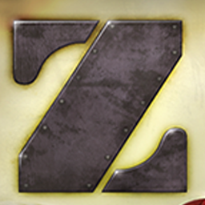
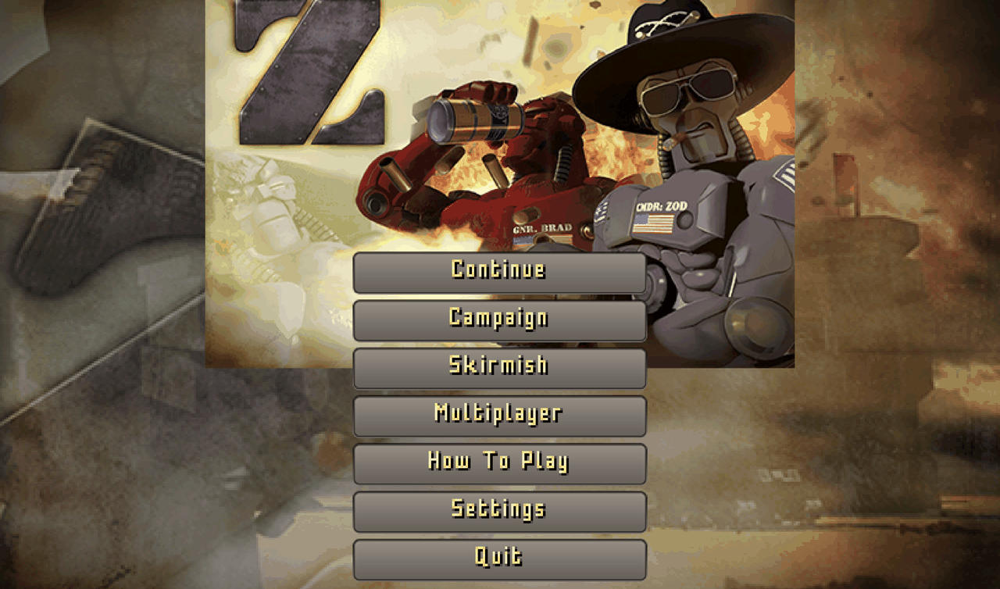
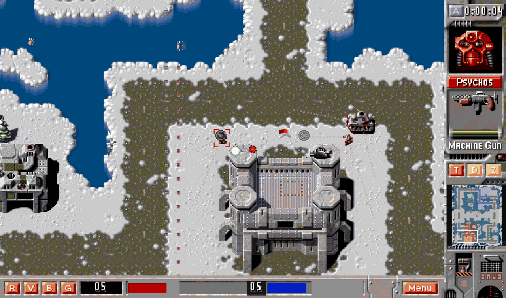
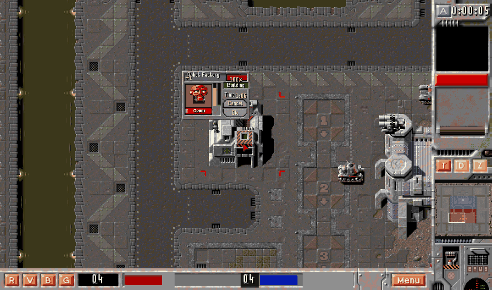
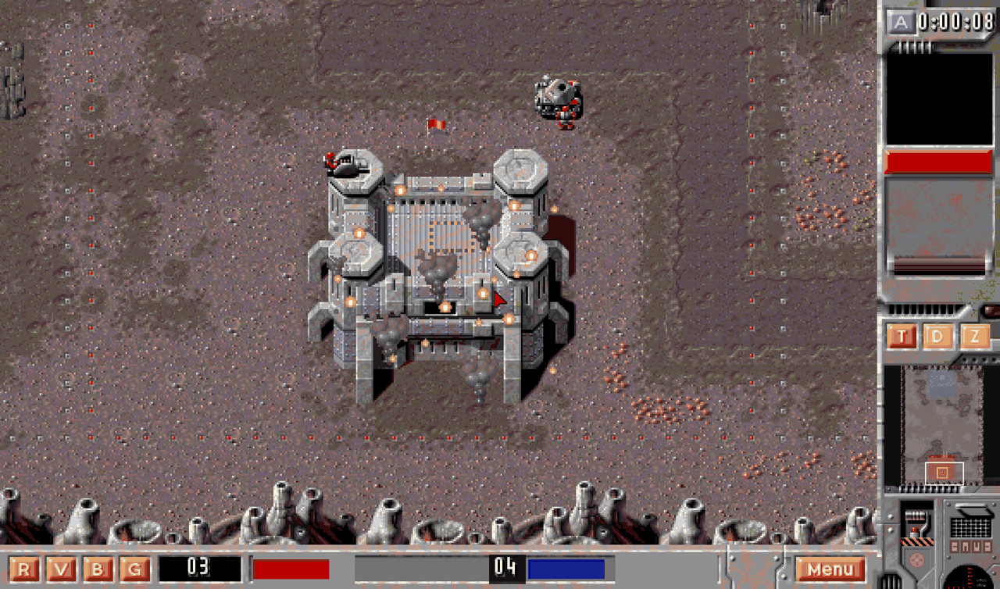
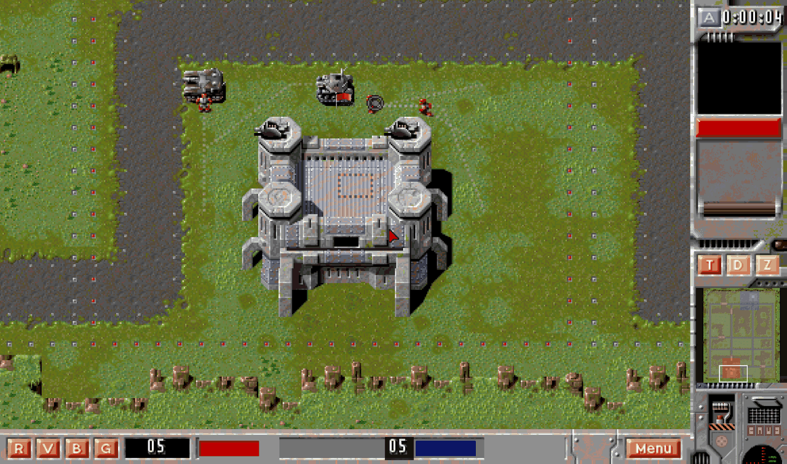

<div align="center">



# Z (1996) — Godot Remake

A fan remake of **Z**, the robot real-time strategy game by The Bitmap
Brothers, rebuilt in Godot 4.

</div>



The remake plays the original 20 campaign levels in the game's own
order. A converter reads them out of the retail data. It also plays the
57 Zod maps and 5 skirmish maps.

The game runs inside the original HUD frame, and uses the original
sprites, sounds and voice lines.

The code in this repository is original. The graphics and sound belong to
The Bitmap Brothers and stay out of the repository. You supply your own
copy — see [Asset licensing](#asset-licensing).

**Status.** Single player is feature complete. Multiplayer has a P2P
lobby, intent replication, host-authoritative resync and late join. The
test suite is 49 headless lanes, and all of them assert. Every lane is
green in the editor and green inside the exported binary.

## The Zod Engine source is the reference

The 1996 Bitmap Brothers code was never released. The
[Zod Engine](https://github.com/capehill/zodengine) is the open
reimplementation that this project's asset pack comes from, so it is the
reference of record. This project reads behaviour from it and cites the
function in `docs/RESEARCH.md` instead of guessing:

- `ZBuilding::ProcessBuildingsEffects` — how a damaged building burns.
- `zsettings.cpp SetDefaults` and `ZServer::ProcessMissileDamage` —
  every explosive radius, and the splash model.
- `ZBot::GoAllOut_3` — how much of its army the CPU commits, and when.

Read it before you call anything underivable. Two items in
`docs/BUGS.md` said "cannot be derived from the art alone" and only
needed somebody to open the file.

## Screenshots

All five planets ship with their own tileset, scenery, rubble and
minimap palette. These four are arctic, city, volcanic and jungle.

A Psycho selected on the arctic ice. The sidebar carries the head
portrait, the name plate, the weapon plate and the health bar, and the
radar window shows the planet's own minimap colors.



A robot factory on the city streets, with the production window on the
release's own 112x80 frame — the Time countdown, the building health
readout, and the level and progress gauges.



A fort burning on volcanic rock. The count of fires and smoke plumes
grows as its health falls, and the ruin goes on burning after it falls.



Armour on the jungle grass, in front of a fort with guns mounted on its
towers.



## Play it

You need Godot **4.7.1** and your own asset copy.

```bash
python3 tools/gog/convert_assets.py   # sfx, music, HUD art from the GOG release
python3 tools/zod/copy_art.py         # unit and map sprites from the Zod pack
flatpak run org.godotengine.Godot     # open project/project.godot, then press F5
```

**Controls.** The arrow keys, the screen edge, a middle-mouse drag or
the radar pan the camera. The wheel zooms. Drag to box-select,
double-click to take every unit of that type on screen, right-click to
order. `Ctrl`+right-click **queues** the order behind what the unit is
already doing.

Every hotkey is the letter printed on the HUD plate that it presses, so
the frame teaches its own keyboard:

| Key | Action | Key | Action |
|---|---|---|---|
| `A` | jump to the last alert | `R` | select all robots |
| `T` | smart idle | `V` | select all hardware |
| `D` | defend (toggle) | `B` | cycle factories |
| `Z` | attack-move (toggle) | `G` | cycle control groups |
| `X` | dismount | `Ctrl`+`A` | select the whole army |

`Ctrl`+digit assigns a control group. The digit alone selects it, and a
second press moves the camera to that squad. Neither `D` nor `Z` lit
means a plain move.

Two commands are not on any plate because the original had neither:
`S` **stops** the selection (cancels the order, the waypoint chain and
any held post) and `H` **holds** the ground it stands on. The letters
are commands only — WASD no longer pans, because holding `D` to look
right also flipped the DEFEND stance on the frame it pressed. Shift on a
build button fills that production line to its cap in one press.

Two original habits are on by default: an order drops the selection
(a queued order does not, or a chain would be impossible to build), and
a click on a unit centers the camera on it. Both are switchable in
Settings. The release's own 7 tutorial pages are on the title menu under
**How To Play**.

## Build the desktop releases

All three targets cross-build from Linux. You need the Godot 4.7.1 export
templates and the icon set.

```bash
python3 tools/gog/make_icons.py   # cuts the Z logo out of the retail splash
tools/build_releases.sh           # linux + windows + macos
tools/build_rpm.sh                # wraps the Linux binary as a Fedora RPM
```

| Target | Output | Notes |
|---|---|---|
| Fedora | `build/rpm/z-remake-*.rpm` | installs `/usr/bin/z-remake`, a desktop entry and the hicolor icon tree. `Release` carries a build stamp, so a rebuild always upgrades in place. |
| Linux | `build/linux/z-remake.x86_64` | one self-contained binary |
| Windows | `build/windows/z-remake.exe` | self-contained, with version metadata. The Explorer file icon stays Godot's default, because a custom one needs `rcedit`, which needs wine. The game window icon is correct. |
| macOS | `build/macos/z-remake.zip` | universal (x86_64 and arm64), unsigned. A cross-build is fine, but you must sign and notarize on a Mac, so the first launch needs right-click → Open. A `.dmg` cannot be produced off a Mac. |

> **Every binary embeds the original art and sound.** Build them for
> yourself. Do not attach them to a release, and do not redistribute
> them. `build/` is gitignored for that reason.

## The CPU opponent

One brain runs per non-player fort team. Each think pass it produces from
every owned facility, defends owned ground, crews the empty hardware on
the map, runs maintenance, holds the frontier bridges, then assigns
whatever is left.

The assignment ports `ZBot Stage1AI_3`. It is what stops the brain
swarming one point:

1. **Posture** (`GoAllOut_3`). The bot compares its share of the map's
   zones against a fair share of 1/teams, and reads two numbers off it:
   what fraction of the idle army to re-task, and how long to wait for
   the next cycle. A fair share means a small slice on a slow cadence
   with a wider target list. Falling behind means a third of the army
   every few seconds.
2. **Targets in the original's priority order.** Map items first (zone
   flags and crates), then buildings, then empty hardware. Enemy units
   come last, and only once the bot is all out.
3. **Mutual-nearest matching** (`MatchTargets_3`, `GiveOutOrders_3`). A
   pair gets an order only when the unit is that target's nearest
   candidate and that target is the unit's. A unit with no mutual
   partner waits out the cycle. A building takes a squad, which is the
   focus fire. Everything else takes one unit, so the army fans out.

`--tactics-test` asserts that the posture table follows the map share,
and that the matching spreads units instead of piling them.

## Repository layout

| Path | Purpose |
|---|---|
| `docs/` | research notes, roadmap, bug tracker, asset conventions |
| `project/` | the Godot project |
| `packaging/linux/` | RPM spec and desktop entry |
| `tools/` | asset converters and build scripts |
| `assets_original/gog/` | the GOG release: sfx, soundtrack, HUD art (gitignored, 383 MB) |
| `assets_original/zod/` | the Zod Engine set: unit and map sprites (gitignored, 84 MB) |
| `project/assets/` | the working asset set, built by the tools (gitignored) |

**Asset tools.** `gog/level_to_json.py` converts the original 20 levels
from the retail `LEVEL##.MAP` data — the format notes are in
`docs/RESEARCH.md` §6. `gog/convert_assets.py` takes sfx, music and HUD
art. `zod/copy_art.py` is a declarative copier for the Zod pack.
`zod/build_hud.py` bakes the HUD pieces and the animated head portraits,
and recovers the face-piece offsets by brute force (§2e).
`zod/map_to_json.py` and `zod/tileinfo_to_json.py` convert the map and
terrain tables. `zod/verify_map_planets.py` audits and repairs the planet
tag on every converted map — run it after any map conversion.

**Maps** load as JSON or as editable Godot scenes. Open any
`project/assets/maps_scenes/*.tscn`, paint terrain with the generated
tilesets, move buildings, zones and units, then press F6 to play.
Regenerate the scenes from the JSON with `godot --headless --path project
res://tools/build_map_resources.tscn`.

**Code layout.** The autoloads are **ContentDB** (the content registry,
with inspector-editable `.tres` defs under `content/`), **Fx**
(presentation), **SaveSystem** (the per-entity save contract),
**NavWorld** (pathing), **MatchState** (economy, upgrades, caps),
**UnitRegistry** (typed unit queries), **GameState** (match flow and
win), **SelectionManager**, **MusicPlayer** and **Campaign**. Then
`scripts/content` holds the Resource def classes, `scripts/entities` the
units, buildings and effects, `scripts/game` orders, combat, the spawner,
the map loader and the AI, and `scripts/ui` the signal-driven HUD. To add
content, copy a `.tres` and drop an art folder — the steps are in
`docs/ASSET_CONVENTIONS.md`.

## Tests

49 headless lanes. Run them in parallel from `project/`:

```bash
res://scenes/main.tscn --<flag>-test --quit-after 6000
```

`--quit-after` counts **frames**, not seconds. It is Godot's own option.
The real-physics lanes need a few thousand frames, so use 6000 for a
whole sweep.

A lane passes with zero `SCRIPT ERROR` lines and zero `CHECK FAILED`
lines. The harness lives in `project/scripts/tests/`. TestRig is the
assertion helper.

**Run the suite inside the exported binary too.** The title screen hands
over to the match scene when it sees a test flag, so the same lanes run
against a build:

```bash
build/linux/z-remake.x86_64 --headless --art-test --quit-after 6000
```

This matters. An editor-only green run proves nothing about a build: a
packaged game once loaded no building defs, no unit folders and no effect
art, with all 47 lanes green in the editor, because Godot packs an
imported file as a `.import` sidecar and every directory scan filtered on
the source extension. The export lane is what found it.

For a screenshot, add `--screenshot <seconds>`. It warps the mouse, so
edge pan stays put.

## Asset licensing

The original Z graphics and sounds belong to © The Bitmap Brothers. The tools
extract them from the Zod Engine asset pack and the GOG release into
`assets_original/` and `project/assets/`, and both paths are
**gitignored**. Every contributor copies them locally.

Do not redistribute them. The screenshots above are in the repository
for documentation only.

The code in this repository is original.
